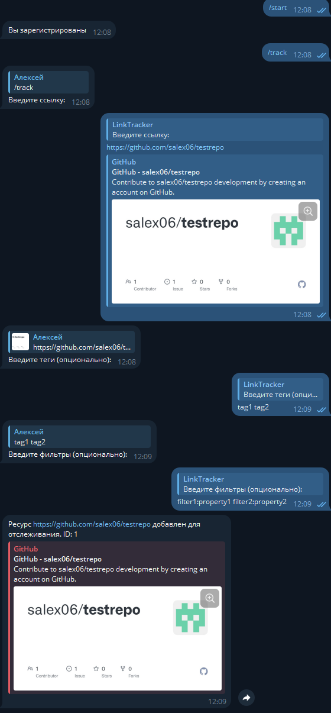
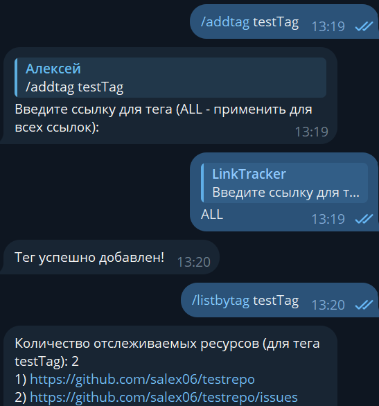
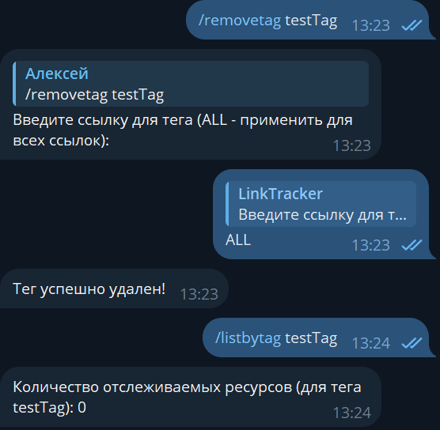
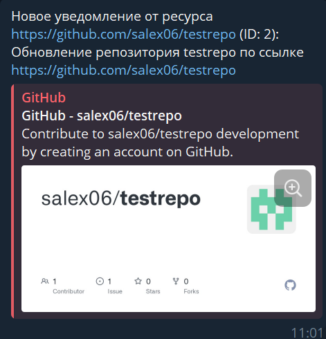
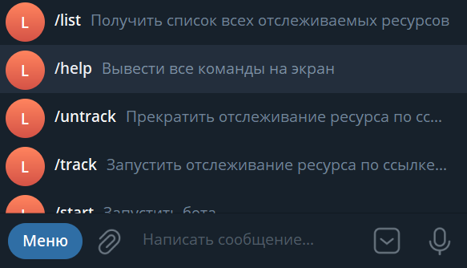

# Link Tracker

## Введение

Проект сделан в рамках курса Академия Бэкенда.

Приложение для отслеживания обновлений контента по ссылкам.
При появлении новых событий отправляется уведомление в Telegram.

Проект написан на `Java 23` с использованием `Spring Boot 3`.

Проект состоит из 2-х приложений:

* Bot
* Scrapper

Для работы требуется БД `PostgreSQL`. Присутствует опциональная зависимость на `Kafka`.

Для дополнительной справки: [HELP.md](./HELP.md)

## Bot

Бот является посредником между сервисом Scrapper и пользователем. Он отвечает
за корректное получение данных от пользователя и отправку сообщений в чат.

Бот поддерживает следующие команды:

|  Команда   |              Назначение               |
|------------|---------------------------------------|
| /start     | Регистрация пользователя              |
| /help      | Вывод списка доступных команд         |
| /track     | Начать отслеживание ссылки            |
| /untrack   | Прекратить отслеживание ссылки        |
| /list      | Показать список отслеживаемых ссылок  |
| /listbytag | Получить список ссылок с данным тегом |
| /addtag    | Добавить тег для ссылки (ссылок)      |
| /removetag | Удалить тег для ссылки (ссылок)       |

Все неизвестные команды игнорируются, бот выводит специальное сообщение

### Команда /track

Команда начала отслеживания ссылки состоит из нескольких шагов в ходе которых пользователь
должен передать боту ссылку на ресурс, теги (опционально) и фильтры (опционально). После завершения
такого диалога бот формирует запрос на отслеживание ссылки к сервису Scrapper

Пример диалога:



### Команда /addtag

Команда добавления тега для ссылки состоит из нескольких шагов. Пользователь отправляет
в сообщении команду /addtag, а также сам тег, который необходимо добавить. Далее бот
запрашивает ссылку, для которой будет добавлен тег (можно выбрать ALL для добавления
тега ко всем ссылкам). После завершения диалога формируется запрос к сервису Scrapper
для добавления тега

Пример диалога:



### Команда /removetag

Команда удаления тега для ссылки состоит из нескольких шагов. Пользователь отправляет
в сообщении команду /removetag, а также сам тег, который необходимо удалить. Далее бот
запрашивает ссылку, для которой будет удален тег (можно выбрать ALL для удаления тега для
всех ссылок). После завершения диалога формируется запрос к сервису Scrapper на
удаление тега

Пример диалога:



### Уведомления

При обновлении ресурса сервис Scrapper отправляет боту команду
на уведомление пользователя.

Пример уведомления:



### Меню команд

Для более удобной работы с ботом реализовано меню команд, с помощью
которого можно найти саму команду и описание команды.

Вид меню:



## Scrapper

Scrapper - сервис, который регистрирует чаты, ссылки,
проверяет отслеживаемые ресурсы на наличие обновлений,
посылает запросы на уведомление пользователя боту.

Scrapper поддерживает регистрацию и отслеживание ссылок вида:

|            Сайт            |             Пример ссылки             |                             Описание                             |  Класс клиента-обработчика  |
|----------------------------|---------------------------------------|------------------------------------------------------------------|-----------------------------|
| https://github.com/        | /{OWNER}/{REPO}                       | Отслеживание изменений в репозитории (ИЗ 1 ДЗ, без изменений)    | GitHubPersonalStorageClient |
| https://github.com/        | /{OWNER}/{REPO}/issues/{ISSUE_NUMBER} | Отслеживание изменений в задаче (issue) (ИЗ 1 ДЗ, без изменений) | GitHubSingleIssueClient     |
| https://github.com/        | /{OWNER}/{REPO}/(issues \| pulls)     | Отслеживание обновлений в issue или pr (ДЛЯ ДЗ 2)                | GitHubIssueListClient       |
| https://stackoverflow.com/ | /questions/{QUESTION_ID}              | Отслеживание любых изменений для вопроса (ДЛЯ ДЗ 2)              | SoQuestionClient            |

В сервисе Scrapper для планирования задач реализован класс *Scheduler*, запускающийся каждые
50 с. Планировщик выполняет обход по отслеживаемым ссылкам и в случае наличия обновлений передает
управление классам, реализующим интерфейс NotificationSender, для отправления запроса к сервису Bot

## Запуск приложения

1. Склонируйте проект с помощью команды

   ```shell
   git clone git@github.com:central-university-dev/java-salex06.git
   ```
2. Откройте проект в любой IDE
3. Создайте файл application.env и запишите туда токен бота в телеграме и
   название бота в следующем формате:

   ```shell
   APP_TELEGRAM_TOKEN={YOUR_BOT_TOKEN}
   APP_TELEGRAM_NAME={YOUR_BOT_NAME}
   ```
4. Настройте конфигурацию запуска для того, чтобы переменные среды были видны
   приложению (на токен и имя бота есть ссылки в файле application.yaml)
5. Запустите docker-compose из корня проекта. Для этого в консоли пропишите команду:

   ```shell
   docker-compose up --build
   ```

   После запуска начнется процесс миграции и подключения БД

6. Запустите приложение в IDE. Готово!

* Для остановки контейнеров пропишите команду из корня проекта:

  ```shell
  docker-compose down
  ```

